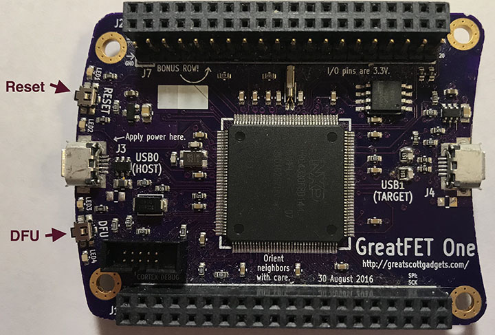

## Getting Set Up

Over the course of this training, you'll solve challenges that use real hardware and software. Before each challenge, you'll want to take a moment to set up your _host PC_ and _GreatFET devices_.

Most challenges will include a pair of _binaries_:

* __Binaries with a <i class="fas fa-laptop"></i> icon are intended to run on your <i>host computer</i>, and are "statically linked"-- which means they include most of their dependencies.__ <br />They've been tested with the Ubuntu image distributed during in-person classes, but will likely also work on other Linux installations.
* __Binaries with a <i class="fab fa-usb"></i> icon are intended to run on a _GreatFET_ __.<br/>You'll program these to <u>one</u> of the two GreatFET devices provided with the course-- allowing the GreatFET to simulate a target device.

<br />
####Ensuring you're on the latest verisons
The live USB image provied with the course ships with copies of each of the open-source projects used in the course. Before you being, run the following commands to ensure you have the latest versions:

```

# Update the GreatFET repo
cd ~/greatfet
git pull origin training_latest
cd host
sudo python  setup.py install
sudo python3 setup.py install

# Update the FaceDancer repo
cd ~/facedancer
git pull origin training_latest
sudo python  setup.py install
sudo python3 setup.py install
```

<br />
####Loading a GreatFET Binary <i class="fab fa-usb"></i>

The easiest way to load <i class="fab fa-usb"></i> _GreatFET Target_ binaries is using the `greatfet_firmware`. To keep things simple, we'll load from _Device Firmware Update (DFU) mode_ -- which works no matter the state of your GreatFET and makes selecting which GreatFET you're working with easy. 



Entering DFU mode is simple:

1. Press and hold the `DFU` button on your GreatFET.
2. Without releasing the `DFU` button, press and release the `RESET` button.
3. Release the `DFU` button. Your GreatFET should not have any illuminated LEDs, and should show up as a `NXP Semiconductors LPC, 1fc9:000C`.

Once the device is in DFU mode, you can load a GreatFET binary with the following command:

```
greatfet firmware -d -w <bin_filename>
```

or, for short:

```
gf fw -d -w <bin_filename>
```

For example, if your binary was called `single_packet_analysis.bin`, you could load and run it with the following command:

```
greatfet firmware -d -w single_packet_analysis.bin
```

You can use the same process to restore the default GreatFET firmware. An appropriate version of the GreatFET firmware is provided on the <a href="/tools">tools page</a> and in the home folder of the course Live USB. You can restore the original firmware at any time by running the following command with the GreatFET in DFU mode:

```
greatfet firmware -d -w ~/greatfet_usb.bin
```

<br />
####Running a Host Binary <i class="fas fa-laptop"></i>

Host binaries are designed to run from the training's live environment, but will likely run on any modern Linux machine. You can run these binaries in the same way you'd run any other Linux script or binary. To run a program called `host_communication`, you'd simply run the binary from the Linux command line:

```
./host_communication
```
